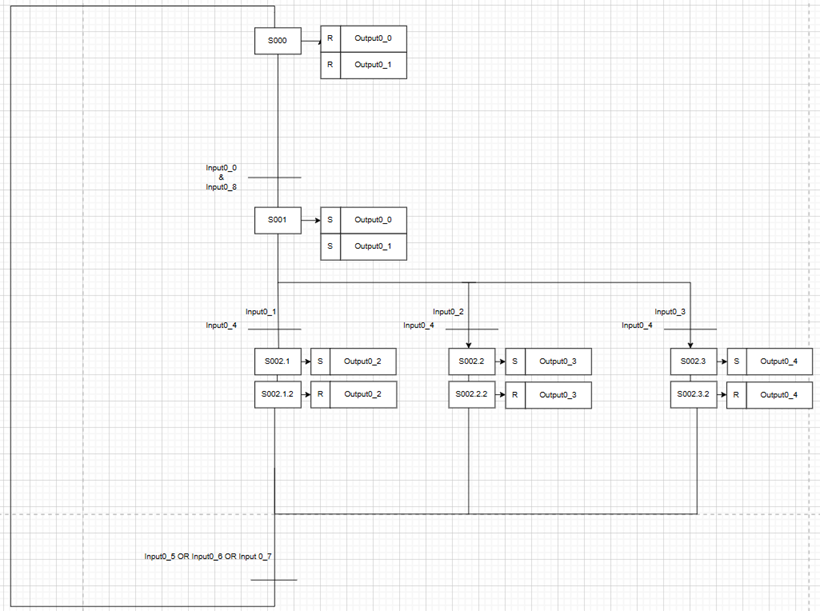
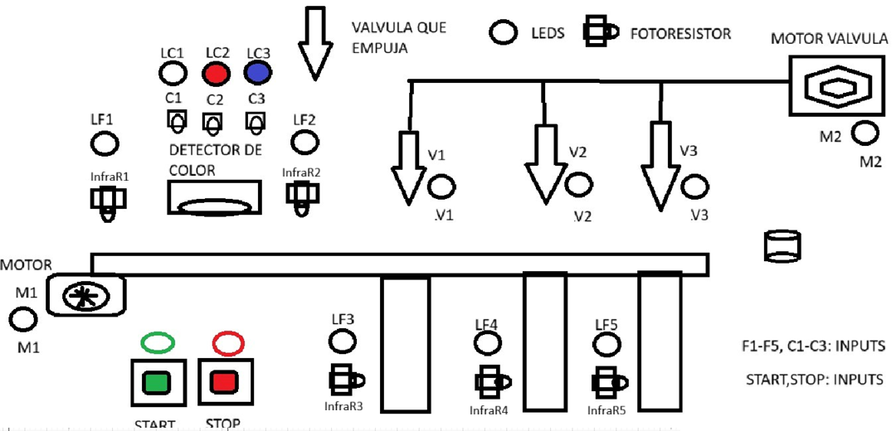

# proyectoFinal
# Sorting Line with Color Detection
## Valentina Ruiz, Tomas Barrios, Darek Aljuri, Rafael Salcedo
## 1. Resumen General

El proyecto busca desarrollar un prototipo funcional de línea de clasificación de piezas por color, utilizando el kit Sorting Line with Color Detection 9V de Fischertechnik, con el fin de representar de forma práctica un proceso de control industrial real e integrar los principios de percepción (sensores), actuación (actuadores), computación (controlador) y conectividad, propios del IIoT.

En la vida real, este tipo de sistema es aplicable en múltiples sectores como la industria alimentaria con la clasificación de frutas, vegetales o granos según color, maduración o defectos, la industria farmacéutica para la separación de pastillas o cápsulas defectuosas, líneas de ensamblaje para control de calidad y separación de componentes en función de su acabado o características visuales.

Además, el proyecto busca desarrollar un gemelo digital completamente operativo de la máquina de clasificación por color, implementado en CODESYS. Mediante programación en Ladder, se construirá una visualización interactiva en la que cualquier cambio realizado desde la interfaz del gemelo digital se reflejará directamente en el sistema físico. A su vez, el HMI mostrará en tiempo real el comportamiento del prototipo, permitiendo supervisar el proceso completo mientras ocurre. Esto no solo facilita la digitalización del sistema, sino que también permite validar, ajustar y optimizar el funcionamiento del prototipo con precisión durante su operación real.

### Descripción del proceso fisico 

La línea de clasificación consiste en [1]:

- Alimentación de piezas: Las piezas, geométricamente idénticas pero de diferentes colores, ingresan al sistema mediante una cinta transportadora impulsada por un motor
  
- Percepción: Un sensor óptico de color detecta la tonalidad de cada pieza a partir de la reflexión de su superficie. Durante el paso de la pieza por debajo del sensor, se determina el valor mínimo medido y este se compara con valores límite para asignar la pieza a los colores blanco, rojo o azul.

- Computación y control: El controlador procesa la señal del sensor, compara el valor mínimo con los umbrales configurados y clasifica cada pieza según su color. El instante de expulsión se define a partir de la detección previa de la pieza por una barrera de luz y la posición medida por el interruptor de pulsos.

- Actuación: Dependiendo del color detectado, las válvulas solenoides activan cilindros neumáticos que desvían las piezas hacia la rampa o contenedor asignado.

- Salida: Las piezas expulsadas se dirigen a través de tres rampas hacia los compartimientos correspondientes. Barreras de luz supervisan el flujo de piezas y el estado de llenado de cada compartimiento.

### Gemelo digital
#### *Descripcion*

Un gemelo digita es una representación virtual de un objeto o sistema diseñado para reflejar un objeto físico con precisión. Abarca el ciclo de vida del objeto, se actualiza a partir de datos en tiempo real y utiliza la simulación, el machine learning y el razonamiento para ayudar a tomar decisiones. [2]

El gemelo digital desarrollado en CODESYS consiste en una réplica virtual, interactiva y conectada en tiempo real de la máquina física de clasificación por color. A través de programación en Ladder y de una interfaz HMI integrada, el gemelo digital reproduce fielmente el comportamiento del prototipo, mostrando el estado de los sensores, actuadores, temporizadores y etapas secuenciales mientras el proceso ocurre físicamente.

Este modelo no solo permite visualizar el funcionamiento interno del sistema, sino que además es bidireccional: cualquier acción ejecutada desde la interfaz del gemelo digital, se refleja inmediatamente en el sistema físico, gracias a la comunicación directa entre el controlador y el entorno virtual. De igual forma, cualquier cambio que ocurra en el prototipo real (detección de color, activación de sensores, movimientos de actuadores) se actualiza en tiempo real en la interfaz del gemelo digital.

De esta manera, el gemelo digital cumple funciones de supervisión, diagnóstico, verificación y validación, permitiendo al usuario entender, ajustar y optimizar el comportamiento del sistema sin necesidad de intervenir físicamente en el prototipo cada vez que se requiera realizar pruebas o modificaciones.

#### *Funcionamiento*

Para habilitar la comunicación bidireccional entre el prototipo físico y el gemelo digital implementado en CODESYS, se utiliza Modbus TCP como protocolo de enlace. En este esquema, el gateway virtualizado de CODESYS actúa como maestro Modbus, mientras que el ESP32 funciona como un microcontrolador con rol de PLC esclavo, encargado de gestionar el hardware físico de la línea de clasificación.

El ESP32 ejecuta firmware en C, mediante el cual lee los sensores (sensor de color, barreras infrarrojas y detectores de posición), controla los actuadores neumáticos y motores, y publica su estado a través de registros Modbus accesibles por el entorno de CODESYS. Cada actualización del proceso físico se transmite al sistema digital, permitiendo que el HMI muestre en tiempo real el comportamiento del prototipo. De igual manera, cuando CODESYS envía comandos Modbus el ESP32 los recibe y los ejecuta directamente sobre el hardware.

  - **Modbus**: El protocolo Modbus sigue una arquitectura de maestro y esclavo, en la que un maestro transmite una solicitud a un esclavo y espera la respuesta. Esta arquitectura brinda al maestro control completo sobre el flujo de información [3]. Teniendo en cuenta lo anterior, Modbus permite que el ESP32 actúe como esclavo PLC, exponiendo a través de registros Modbus el estado de sensores como el detector de color, barreras infrarrojas y señales de posición. CODESYS, operando como maestro Modbus, consulta estos registros y refleja en tiempo real estos datos en el gemelo digital y en el HMI. Esto garantiza que la visualización digital siempre muestre lo que ocurre físicamente en el prototipo.

  - **Esp32**: cumple un papel central al funcionar como el microcontrolador PLC encargado de la interacción directa con el prototipo físico de la máquina de clasificación. Es el dispositivo responsable de ejecutar la lógica de adquisición de datos, control de actuadores y comunicación hacia la capa digital mediante Modbus. En resumen, Expone datos y recibe comandos mediante Modbus, permitiendo la conexión con CODESYS, sincroniza el proceso real con el gemelo digital, asegurando una visualización y un control en tiempo real y hace posible sea interactivo, ejecutando tanto la lógica interna como las acciones enviadas desde la capa digital.

## 2. Etapas de diseño

### Flujo definido

- Percepción física → sensores
- Actuación física → válvulas y motor
- Control local → ESP32 (Arduino)
- Supervisión y visualización → CODESYS + HMI + Ladder
- Comunicación  → Modbus TCP
- Conectividad IIoT → MQTT → Ubidots
- Representación digital en tiempo real → Gemelo digital

### Diagramas UML 

.

.

..

.

.

### Análisis del proceso

El sistema corresponde a una máquina clasificadora de objetos por color (sorting color machine). El flujo general del proceso es el siguiente:

1. ***Inicio del sistema***

- El sistema se encuentra en estado de reposo, con la banda transportadora detenida y las válvulas neumáticas cerradas.
- El usuario puede iniciar el ciclo desde:
  - el prototipo físico o
  - el gemelo digital en CODESYS (HMI).
- El recibir la señal de inicio, CODESYS envía la orden vía Modbus al ESP32, activando el motor principal (M1) si corresponde.

2. ***Detección inicial de pieza***

- Un sensor infrarrojo ubicado al inicio de la banda detecta la presencia de una pieza.
- El ESP32 registra este evento y actualiza el registro Modbus correspondiente.
- El gemelo digital refleja inmediatamente la detección en el HMI.
  - Si no hay pieza, la banda permanece detenida.
  - Si hay pieza, el motor arranca y comienza el transporte.

3. ***Transporte hacia la cámara de detección (caja roja)***

- La pieza avanza sobre la banda transportadora.
- El ESP32 continúa enviando actualizaciones periódicas a CODESYS.

4. ***Detección de color***

- La pieza ingresa a la cámara de detección (caja roja).
- El sensor de color mide el valor de reflexión y determina el color:
  - Blanco
  - Rojo
  - Azul

- El ESP32 registra el color detectado y lo publica en un registro Modbus.

- El HMI actualiza automáticamente la variable de color detectado.

- El color queda almacenado para usarlo en la etapa de clasificación.
- El color detectado se publica a Ubidots mediante MQTT

5. ***Confirmación de salida + Temporización***

- Un segundo sensor infrarrojo confirma que la pieza salió de la caja roja.

- Dependiendo del color detectado, se activa un temporizador específico (T1, T2 o T3).

- El temporizador proporciona un retardo preciso para que la pieza llegue a la estación adecuada antes de actuar.

- El avance del temporizador se muestra en tiempo real en el HMI del gemelo digital.

6.***Clasificación por color***

- Una vez finalizado el temporizador, CODESYS activa el registro Modbus que corresponde a la válvula adecuada.El ESP32 recibe el comando y energiza la válvula solenoide (NC).
- La válvula permite el paso de aire comprimido hacia el cilindro neumático.
- El pistón empuja la pieza hacia su compartimiento de clasificación correcto.
- La válvula se desactiva cuando se completa el tiempo de actuación.
- El pistón retorna a su posición inicial mediante un resorte.
- El HMI muestra cuál válvula fue activada (V1, V2 o V3).

7. ***Verificación de clasificación***

- En cada compartimiento de salida hay un sensor infrarrojo final (F3, F4, F5).

- Al detectar la llegada de la pieza, el sensor envía la señal al ESP32.

- El ESP32 actualiza los registros Modbus, informando a CODESYS que la clasificación fue exitosa.

- El HMI muestra el resultado y marca la etapa como completada.
- El registro se envia a Ubidots mediante MQTT

8. ***Detención temporal y reinicio del ciclo***

- Tras la verificación de la clasificación, la banda se detiene.
- El sistema reinicia todas las salidas (Reset).
- Se vuelve al estado de inicio del proceso (S000).
- El sistema queda listo para recibir la siguiente pieza.

### Restricciones de diseño

Las siguientes restricciones de diseño del prototipo se establecieron siguiendo la ISO/IEC/IEEE 29148:2018, estándar que define buenas prácticas para la especificación de requisitos de sistemas y software. Bajo esta guía, se formularon los requerimientos funcionales y no funcionales considerando aspectos técnicos, asi como de escalabilidad y conectividad, con el fin de asegurar un diseño claro, trazable y evaluable.

| Código | Tipo        | Nombre del Requerimiento | Descripción                                                                 | Prioridad | Viabilidad técnica                                                                 | Restricciones                                      | Recursos requeridos                        | Impacto                                               |
|--------|-------------|--------------------------|-----------------------------------------------------------------------------|-----------|--------------------------------------------------------------------------------------------------------|---------------------------------------------------|--------------------------------------------|-------------------------------------------------------|
| RF-01  | Funcional   | Detección de color       | El sistema debe identificar piezas de al menos 3 colores distintos mediante el sensor óptico. | Alta      | El kit Fischertechnik incluye un sensor de color analógico calibrable para distinguir múltiples tonos. | Limitado al espectro soportado por el sensor       | Sensor óptico de color                     | Permite clasificación automática.                     |
| RF-02  | Funcional   | Clasificación automática | El sistema debe desviar cada pieza hacia el contenedor correspondiente según su color. | Alta      | El kit dispone de compresor, válvulas y actuadores neumáticos que permiten desviar las piezas con precisión. Así como fototransistores para garantizar la presencia de los objetos y la sincronización del sistema. | Número de salidas limitado a 3 contenedores      | Motores, válvulas, compresor y fototransistores              | Representa el proceso industrial de sorting.          |
| RF-03  | Funcional   | Registro de datos        | El sistema debe enviar el resultado de clasificación (color detectado y cantidad de piezas) a un servidor IoT. | Media     | El controlador TXT/PLC puede comunicarse vía Ethernet/WiFi con un servidor externo, aunque requiere configuración adicional.  | Depende de conectividad disponible                 | Controlador con WiFi/Ethernet, servidor IoT| Integra IIoT y análisis remoto.                       |
| RF-04  | Funcional   | Interfaz de monitoreo    | El usuario debe visualizar en tiempo real la operación (colores detectados, conteo, estado de actuadores). | Media     |  Existen plataformas como Node-RED o Grafana que pueden integrarse con el controlador para mostrar datos en dashboards simples. Inicialmente, se muestran datos básicos en el display del controlador.| Requiere desarrollo de software adicional          | Node-RED, Grafana o app web                | Mejora la usabilidad y monitoreo remoto.              |
| RNF-01 | No funcional| Limitación de energía    | El prototipo debe funcionar con fuentes de 9v y los sensores adicionales deberian funcionar con 9 o 5 v   | Media      |  Los voltajes deben estar soportados oficialmente por Fischertechnik, y se dispone de fuentes de laboratorio. | Depende de disponibilidad de fuente y controlador  | Fuente de poder, adaptadores               | Asegura compatibilidad con componentes Fischertechnik. |
| RNF-02 | No Funcional | Mantenibilidad | El sistema debe estar diseñado de forma modular para facilitar el reemplazo de sensores, actuadores o controladores sin necesidad de rediseñar todo el prototipo. | Baja |  Los kits de Fischertechnik son modulares y permiten intercambiar componentes fácilmente. | Limitado a la compatibilidad de módulos disponibles en el kit. | Herramientas básicas, repuestos del kit. | Impacta en la sostenibilidad y reutilización del prototipo a largo plazo. |
| RNF-03 | No funcional| Escalabilidad            | El sistema debe permitir la ampliación hacia más colores o integración con otros módulos. | Baja     |  El controlador dispone de entradas/salidas adicionales que permiten integrar más sensores o módulos industriales. | Limitado por número de sensores/entradas del controlador | PLC o controlador con entradas libres     | Facilita futuras expansiones del proyecto.            |

#### Criterios y estandares de diseño establecidos
El diseño del prototipo de Sorting Line with Color Detection se fundamenta en los lineamientos de la norma ISO/IEC/IEEE 29148:2018 que se refiere a Systems and Software Engineering, Life Cycle Processes, Requirements Engineering [5], la cual establece directrices para la definición de requerimientos funcionales y no funcionales en proyectos de ingeniería. Adicionalmente, se adoptaron estándares aplicables en la industria de automatización y control, asegurando que el sistema sea seguro, escalable, reproducible y mantenible.

##### Principios generales de diseño (IEEE 29148:2018)

- Claridad y no ambigüedad: cada requerimiento debe estar expresado de forma precisa, sin interpretaciones múltiples.

- Corrección: los requerimientos deben reflejar exactamente las necesidades del proceso de clasificación automatizado.

- Consistencia: los requerimientos no deben entrar en conflicto entre sí.

- Rastreo (Traceability): los requerimientos se deben poder vinculae con un objetivo, módulo de diseño, implementación y prueba.

- Viabilidad técnica: los requerimientos deben ser alcanzables con los recursos de hardware/software disponibles.

- Verificabilidad: todo requerimiento debe poder validarse mediante pruebas medibles y repetibles.

- Priorización: los requerimientos deben clasificarse en críticos, deseables y opcionales según el impacto en la operación.

#### Estandar IEC 61131-3
- Estándar internacional para lenguajes de programación de  Controladores Lógicos Programables (PLC) industriales, proporcionando un conjunto de lenguajes y estructuras comunes para la automatización, asegurando la independencia del fabricante y permitiendo la portabilidad y reutilización de código (incluye Ladder). [6]

#### Norma ISO 23247

- Establece un marco de referencia para el diseño, implementación y operación de gemelos digitales en entornos industriales, describiendo los requisitos para la sincronización entre el sistema físico y su representación virtual, la interoperabilidad entre plataformas y la integración con sistemas de automatización y sensores. [7]

##### Criterios específicos del proyecto

- El sistema debe clasificar piezas de acuerdo con colores rojo, azul y verde, con un nivel de precisión ≥ 95 %.

- El tiempo de respuesta entre la detección y la actuación debe ser ≤ 200 ms.

- El prototipo debe permitir escalabilidad para incluir nuevos sensores/actuadores.

- El código y los esquemáticos deben estar completamente documentados para garantizar mantenibilidad.

### Variables Generales del Sistema
| Name      | Attrib  | Type  | Comment                                                                |
|-----------|---------|-------|------------------------------------------------------------------------|
| Input0_0  | [Input] | BOOL  | Sensor F1 — Detecta llegada pieza (activa banda M1 y motor válvula M2) |
| Input0_1  | [Input] | BOOL  | Detector de color C1 — Blanco                                          |
| Input0_2  | [Input] | BOOL  | Detector de color C2 — Rojo                                            |
| Input0_3  | [Input] | BOOL  | Detector de color C3 — Azul                                            |
| Input0_4  | [Input] | BOOL  | Sensor F2 — Zona temporizado (dispara el timer seleccionado por color) |
| Input0_5  | [Input] | BOOL  | Sensor F3 — Llegada a salida/estación 1 (posición V1)                  |
| Input0_6  | [Input] | BOOL  | Sensor F4 — Llegada a salida/estación 2 (posición V2)                  |
| Input0_7  | [Input] | BOOL  | Sensor F5 — Llegada a salida/estación 3 (posición V3)                  |
| Input0_8  | [Input] | BOOL  | START — Pulsador de inicio (habilita ciclo)                            |
| Input0_9  | [Input] | BOOL  | STOP — Pulsador de paro (paro de emergencia / detención)               |
| Output0_0 | [Output]| BOOL  | Motor M1 — Banda transportadora (arranque/parada)                      |
| Output0_1 | [Output]| BOOL  | Motor M2 — Motor de la válvula (o alimentador de válvulas)             |
| Output0_2 | [Output]| BOOL  | V1 — Solenoide / válvula para piezas blancas                           |

### Diagrama de función secuencial

A partir de las variables generales definidas anteriormente, el sistema se diseñó bajo un enfoque de control secuencial por etapas (Step Sequence Control). Cada etapa (S) representa un estado del proceso, mientras que las transiciones se activan cuando se cumplen condiciones de sensores (entradas).

El siguiente diagrama muestra la secuencia de operación implementada:

#### Descripción de la secuencia:

1. Inicio (S000)

 - Estado inicial del sistema.
 - Condición de inicio: Input_5 o Input_6 o Input_7, es decir que la pieza clasificada anterior, haya llegado a su destino.
 - Se asegura de reiniciar todas las salidas (Output_0, Output_1, Output_2, Output_3).

2. Ejecución inicial (S001)

  - Condición de inicio: Input_0 o Input_8. Es decir, el Start, y que una pieza haya entrado al sistema.
  - Acciones: activa las salidas principales (Output_0 y Output_1) que corresponden al motor de la cinta transportadora y el compresor.

3. Detección de pieza y Clasificación (S002.1, S002.2 y S002.3)

  - Condición: sensor de entrada del color 1 (Input0_1) detecta una pieza, asi como ser sensado por el fototransitor posterior a la detección de color (Input_04)
  - Dependiendo de la detección de color:
    - Input0_1 activa Output0_2 (válvula de clasificación 1).
    - Input0_2 activa Output0_3 (válvula de clasificación 2).
    - Input0_3 activa Output0_4 (válvula de clasificación 3).

5. Fin de ciclo y reset (S002.1.2, S002.2.2 y S002.3.2)

  - Una vez completada la expulsión, las salidas se resetean (R), las válvulas vuelven a su posición inicial.
  - El sistema queda listo para el siguiente objeto.

## Desarrollo del Sistema

### Programación Ladder

### 2.3 Definición de Variables para la implementación ladder

#### LADDER

# Descripción funcionamiento del Ladder
## Implementación digital (codesys)

## Implementacion fisica

## Validación manual

- Se comprobó manualmente:

  - El funcionamiento de la banda transportadora.

  - La activación de cada válvula neumática y de los cilindros (lo que empuja las fichas hacia la linea de clasificacion).

  - El reconocimiento de las piezas por parte de los sensores instalados.

Durante esta validación se identificó que los sensores fotoresistivos que originalmente venían con el kit no funcionaban correctamente y, además, la cantidad disponible no era suficiente para cubrir todas las etapas del proceso. Para resolver esta limitación se implementaron módulos externos de la serie MH Sensor, basados en fototransistores, los cuales se utilizaron como reemplazo de las fotoresistencias. Estos módulos permiten detectar de forma confiable el paso de las fichas y verificar su llegada a la clasificación correspondiente.

En la cámara de detección (caja roja) se encuentra el sensor de color, encargado de identificar la tonalidad de cada ficha. Sin embargo, este componente no cuenta con una salida física directa, por lo que no pudo ser probado manualmente en esta etapa. Su validación queda supeditada a la lógica programada en el PLC y a la integración completa del sistema automatizado.

En la imagen se muestra el prototipo completo de la máquina clasificadora de piezas por color, montado con el kit Fischertechnik Sorting Line with Color Detection. El sistema incluye la banda transportadora, la cámara de detección (caja roja), los cilindros neumáticos que desvían las piezas hacia los compartimientos y los sensores de presencia y clasificación.

Debido a que los sensores fotoresistivos originales no funcionaban correctamente ni eran suficientes en cantidad, fueron reemplazados por módulos de sensores con fototransistor de la serie MH Sensor, visibles en la parte frontal de la maqueta. Estos permiten detectar de manera confiable el paso de las fichas y confirmar su llegada a cada compartimiento de clasificación.

El montaje incluye además el cableado eléctrico de prueba y las conexiones neumáticas de las válvulas, lo que permitió validar manualmente el funcionamiento de la banda transportadora, los actuadores y la detección básica de fichas antes de la integración con el PLC.

En la  imagen se observa la válvula 2 activada, correspondiente a la clasificación de piezas de color rojo. Para realizar la prueba de forma manual, se conectó el cable de control de la valvula alternando entre positivo (activación) y negativo (desactivación). Al aplicar el nivel positivo, la válvula se acciona y el cilindro neumático desplaza la pieza hacia el compartimiento correspondiente; al devolverlo a negativo, la válvula regresa a su posición inicial.

Durante esta validación se mantuvo el compresor encendido de manera continua, con una línea siempre en positivo y la otra en negativo, garantizando el suministro de aire sin importar cuál valvula se desee probar. De esta manera, se pudo comprobar individualmente el correcto funcionamiento de cada válvula solenoide y su respectivo actuador neumático.

En esta etapa se realizó la misma validación manual, pero aplicada a la válvula de la línea de clasificación de color rojo. Al igual que en la prueba anterior, la electroválvula fue accionada conectando su entrada de control a positivo (activación) y regresándola a negativo (desactivación). De este modo, se comprobó el desplazamiento correcto del cilindro neumático encargado de desviar las piezas hacia el compartimiento destinado al color rojo, asegurando que la línea de clasificación responde adecuadamente bajo condiciones reales de operación.

Finalmente, se realizó la comprobación manual de la válvula correspondiente a la línea de clasificación de color azul, la cual es la última en el proceso. Esta válvula fue activada de la misma manera que las anteriores, aplicando positivo en su entrada de control para accionar el cilindro neumático y regresándola a negativo para su retorno.

Al tratarse de la última estación de clasificación, esta válvula es la que idealmente se activa tras un mayor tiempo de conteo, dado que las fichas deben recorrer toda la banda transportadora antes de llegar a su posición. La prueba permitió verificar que el actuador neumático responde de manera adecuada y que la línea azul está lista para integrarse en la secuencia automática controlada por el PLC.

## Conclusiones

-  La implementación del gemelo digital en CODESYS permitió simular el comportamiento completo del sistema de clasificación, validando la lógica de control en un entorno virtual antes de llevarla al prototipo físico.

-  El diseño de la HMI facilitó la visualización del proceso en tiempo real, con indicadores claros para el estado de motores, sensores, temporizadores, válvulas y contadores.

-  La sustitución de los sensores fotoresistivos originales por módulos de fototransistor (MH Sensor Series) aseguró la detección confiable de las fichas en la simulación y en el prototipo.

-  En el prototipo físico, las pruebas de válvulas y compresor se realizaron de manera manual, mediante la conmutación de positivo a negativo con un jumper en la protoboard, lo que permitió comprobar el funcionamiento básico de los actuadores neumáticos.

-  Aunque la secuencia automática todavía no se reproduce de manera física, se verificó que la lógica programada en el PLC (temporizadores y contadores) sí responde correctamente en el gemelo digital.

-  El sistema asegura que cada ficha es detectada, clasificada y contabilizada en la simulación, con un límite de dos piezas por compartimiento según la lógica definida.

-  En general, el proyecto permitió comprender la relación entre la programación en ladder y el funcionamiento esperado en el prototipo, quedando como trabajo futuro la integración total del sensor de color en la caja roja y la implementación física de la secuencia automática.

## 6. Referencias

[1] fischertechnik GmbH, "Sorting Line with Color Detection 24 V", fischertechnik, Art.-No. 536633. Disponible en: https://www.fischertechnik.de/en/products/industry-and-universities/training-models/536633-sorting-line-with-color-detection-24v 

[2] IBM. “¿Qué es un gemelo digital?” Think (IBM), 2024. Disponible en: https://www.ibm.com/es-es/think/topics/digital-twin
. [Accedido: 14-Nov-2025]. 

[3] National Instruments, “Introduction to Modbus using LabVIEW”, NI, 2025. Disponible en: https://www.ni.com/es/shop/labview/introduction-to-modbus-using-labview.html [Accedido: 14-Nov-2025].

[4] Emerson, “Válvulas solenoide normalmente cerradas,” Emerson. [En línea]. Disponible: https://www.https://www.emerson.com/es-py/catalog/solenoid-valves/normally-closed-solenoid-valves?fetchFacets=true#facet:&partsFacet:&modelsFacet:&facetLimit:&searchTerm:&partsSearchTerm:&modelsSearchTerm:&productBeginIndex:0&partsBeginIndex:0&modelsBeginIndex:0&orderBy:&partsOrderBy:&modelsOrderBy:&pageView:grid&minPrice:&maxPrice:&pageSize:&facetRange

[5] ISO/IEC/IEEE, ISO/IEC/IEEE 29148:2018 Systems and software engineering — Life cycle processes — Requirements engineering, 2nd ed. Geneva, Switzerland: International Organization for Standardization, Nov. 2018. [Online]. Available: https://www.iso.org/standard/72089.html

[6] “IEC 61131-3 Protocol Overview,” Real Time Automation, Inc., [En línea]. Disponible: https://www.rtautomation.com/technologies/control-iec-61131-3/

[7] Shao, G., Frechette, S., y Srinivasan, V., “An Analysis of the New ISO 23247 Series of Standards on Digital Twin Framework for Manufacturing,” en Proceedings of the 2023 MSEC Manufacturing Science & Engineering Conference, New Brunswick, NJ, USA, 12-16 jun. 2023. Disponible en: https://tsapps.nist.gov/publication/get_pdf.cfm?pub_id=935765
