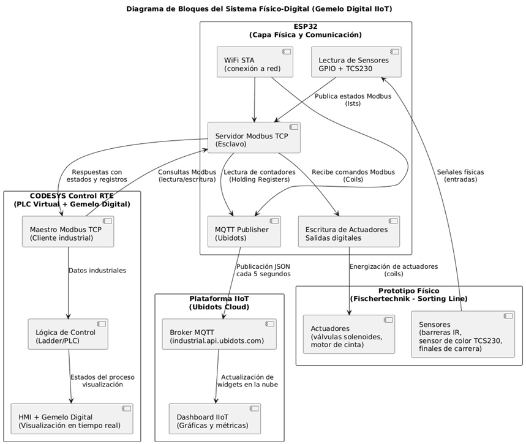
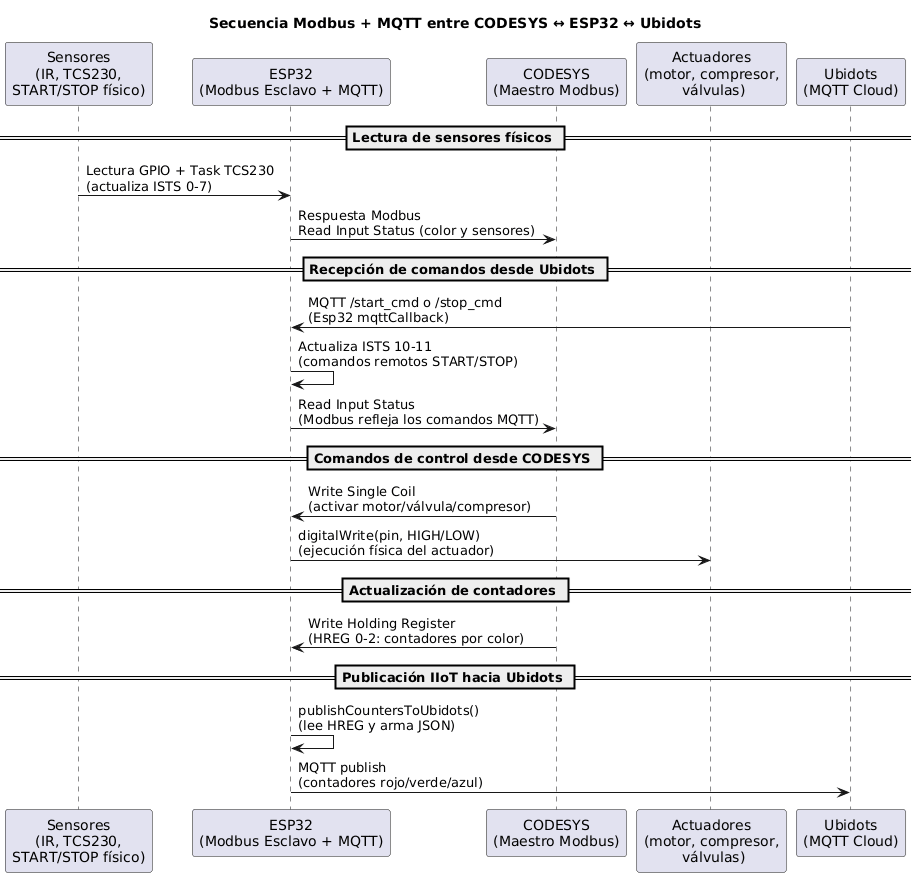
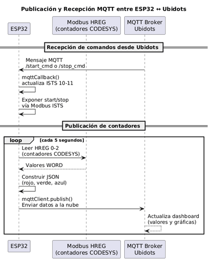
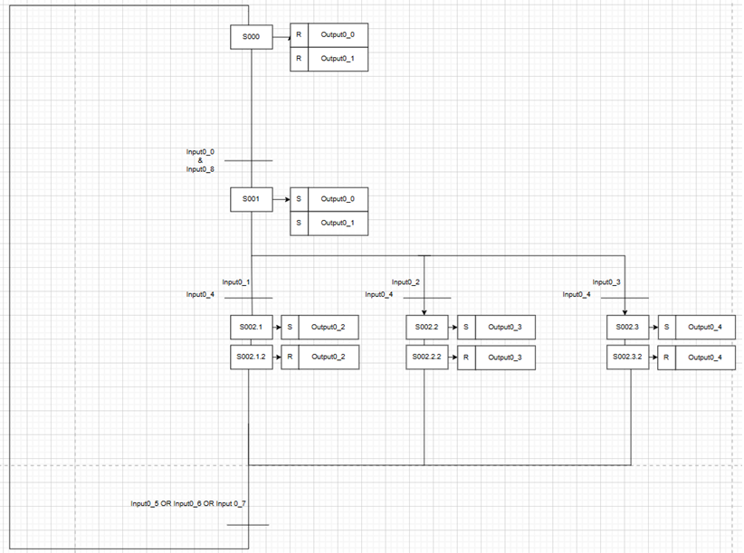
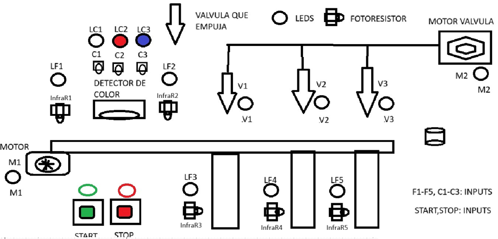

# Proyecto Final Internet Industrial de las Cosas
# Sorting Line with Color Detection
## Valentina Ruiz, Tomas Barrios, Darek Aljuri, Rafael Salcedo
## 1. Resumen General

El proyecto busca desarrollar un prototipo funcional de línea de clasificación de piezas por color, utilizando el kit Sorting Line with Color Detection 9V de Fischertechnik, con el fin de representar de forma práctica un proceso de control industrial real e integrar los principios de percepción (sensores), actuación (actuadores), computación (controlador) y conectividad, propios del IIoT.

En la vida real, este tipo de sistema es aplicable en múltiples sectores como la industria alimentaria con la clasificación de frutas, vegetales o granos según color, maduración o defectos, la industria farmacéutica para la separación de pastillas o cápsulas defectuosas, líneas de ensamblaje para control de calidad y separación de componentes en función de su acabado o características visuales.

Además, el proyecto busca desarrollar un gemelo digital completamente operativo de la máquina de clasificación por color, implementado en CODESYS. Mediante programación en Ladder, se construirá una visualización interactiva en la que cualquier cambio realizado desde la interfaz del gemelo digital se reflejará directamente en el sistema físico. A su vez, el HMI mostrará en tiempo real el comportamiento del prototipo, permitiendo supervisar el proceso completo mientras ocurre. Esto no solo facilita la digitalización del sistema, sino que también permite validar, ajustar y optimizar el funcionamiento del prototipo con precisión durante su operación real.

### Descripción del proceso fisico 

La línea de clasificación consiste en [1]:

- Alimentación de piezas: Las piezas, geométricamente idénticas pero de diferentes colores, ingresan al sistema mediante una cinta transportadora impulsada por un motor
  
- Percepción: Un sensor óptico de color detecta la tonalidad de cada pieza a partir de la reflexión de su superficie. Durante el paso de la pieza por debajo del sensor, se determina el valor mínimo medido y este se compara con valores límite para asignar la pieza a los colores blanco, rojo o azul.

- Computación y control: El controlador procesa la señal del sensor, compara el valor mínimo con los umbrales configurados y clasifica cada pieza según su color. El instante de expulsión se define a partir de la detección previa de la pieza por una barrera de luz y la posición medida por el interruptor de pulsos.

- Actuación: Dependiendo del color detectado, las válvulas solenoides activan cilindros neumáticos que desvían las piezas hacia la rampa o contenedor asignado.

- Salida: Las piezas expulsadas se dirigen a través de tres rampas hacia los compartimientos correspondientes. Barreras de luz supervisan el flujo de piezas y el estado de llenado de cada compartimiento.

### Gemelo digital
#### *Descripcion*

Un gemelo digital es una representación virtual de un objeto o sistema diseñado para reflejar un objeto físico con precisión. Abarca el ciclo de vida del objeto, se actualiza a partir de datos en tiempo real y utiliza la simulación, el machine learning y el razonamiento para ayudar a tomar decisiones. [2]

El gemelo digital desarrollado en CODESYS consiste en una réplica virtual, interactiva y conectada en tiempo real de la máquina física de clasificación por color. A través de programación en Ladder y de una interfaz HMI integrada, el gemelo digital reproduce fielmente el comportamiento del prototipo, mostrando el estado de los sensores, actuadores, temporizadores y etapas secuenciales mientras el proceso ocurre físicamente.

Este modelo no solo permite visualizar el funcionamiento interno del sistema, sino que además es bidireccional: cualquier acción ejecutada desde la interfaz del gemelo digital, se refleja inmediatamente en el sistema físico, gracias a la comunicación directa entre el controlador y el entorno virtual. De igual forma, cualquier cambio que ocurra en el prototipo real (detección de color, activación de sensores, movimientos de actuadores) se actualiza en tiempo real en la interfaz del gemelo digital.

De esta manera, el gemelo digital cumple funciones de supervisión, diagnóstico, verificación y validación, permitiendo al usuario entender, ajustar y optimizar el comportamiento del sistema sin necesidad de intervenir físicamente en el prototipo cada vez que se requiera realizar pruebas o modificaciones.

#### *Funcionamiento*

Para habilitar la comunicación bidireccional entre el prototipo físico y el gemelo digital implementado en CODESYS, se emplea Modbus TCP como protocolo industrial de enlace. En esta arquitectura, CODESYS Control RTE opera como dispositivo maestro Modbus, mientras que el ESP32 actúa como esclavo, funcionando como una capa de interfaz entre el controlador virtual y el hardware físico de la máquina.

A diferencia de un PLC tradicional, el ESP32 no ejecuta la lógica de control del proceso. Toda la lógica secuencial, temporización, condiciones de clasificación y etapas del ciclo se programan en Ladder dentro de CODESYS, donde reside el “cerebro” del sistema. El ESP32 cumple un rol estrictamente operativo y de comunicación:

- Lee y digitaliza las señales de los sensores físicos
(sensor de color, barreras IR, encoder de pulsos, finales de carrera).

- Publica estas señales como registros Modbus para que CODESYS las consulte.

- Recibe desde CODESYS los comandos de actuación (activar válvula, encender motor, expulsar pieza) a través de coils o holding registers.

- Ejecuta físicamente esos comandos mediante salidas digitales conectadas a los actuadores del prototipo.

Con este esquema, cada cambio que ocurre en el prototipo físico se refleja en tiempo real en el gemelo digital, y cada acción ordenada desde el HMI en CODESYS se replica inmediatamente en el hardware mediante el ESP32.

  - **Modbus**: El protocolo Modbus sigue una arquitectura de maestro y esclavo, en la que un maestro transmite una solicitud a un esclavo y espera la respuesta. Esta arquitectura brinda al maestro control completo sobre el flujo de información [3]. Teniendo en cuenta lo anterior, Modbus permite que el ESP32 actúe como esclavo PLC, exponiendo a través de registros Modbus el estado de sensores como el detector de color, barreras infrarrojas y señales de posición. CODESYS, operando como maestro Modbus, consulta estos registros y refleja en tiempo real estos datos en el gemelo digital y en el HMI. Esto garantiza que la visualización digital siempre muestre lo que ocurre físicamente en el prototipo.

  - **Esp32**: no contiene lógica de decisión ni algoritmos de control secuencial. Su función es servir como puente físico-digital, permitiendo que CODESYS controle el proceso como un PLC industrial, toma los valores de sensores físicos y los traduce a registros Modbus, recibe desde CODESYS las señales de control (coils) y energiza directamente los actuadores conectados, actualiza continuamente los registros para que el gemelo digital y la HMI reflejen el estado real del sistema, convierte los comandos PLC a señales eléctricas hacia válvulas y motor

## 2. Etapas de diseño

### Flujo definido

- Percepción física → sensores
- Actuación física → válvulas y motor
- Control local → ESP32 (Arduino)
- Supervisión y visualización → CODESYS + HMI + Ladder
- Comunicación  → Modbus TCP
- Conectividad IIoT → MQTT → Ubidots
- Representación digital en tiempo real → Gemelo digital


### Diagramas UML 

#### 1. Diagrama de bloques 

Este diagrama representa la arquitectura completa del sistema de clasificación por color, integrando el prototipo físico, el PLC virtual en CODESYS, el ESP32 y la plataforma Ubidots en la nube.

El prototipo físico genera señales provenientes de los sensores (barreras infrarrojas, sensor de color TCS230, botones START/STOP) y recibe la activación de los actuadores (motor, compresor y válvulas neumáticas) en función de los comandos entregados por el controlador.

El ESP32 actúa como la interfaz físico–digital del sistema y cumple tres funciones principales:

- Modbus TCP (esclavo):
Expone todos los sensores físicos (ISTS 0–11) y ejecuta las órdenes de actuación que CODESYS envía mediante coils.
No toma decisiones ni ejecuta lógica de control.

- MQTT:

  - Publica a Ubidots los contadores del proceso recibidos desde CODESYS a través de Holding Registers.

  - Recibe comandos remotos START/STOP enviados desde el dashboard de Ubidots y los expone a CODESYS como entradas Modbus (ISTS 10 y 11).

- Gestión de hardware local:
lee sensores físicos, ejecuta el task FreeRTOS del TCS230 y conmuta los actuadores según lo ordenado por el PLC.

El PLC virtual en CODESYS opera como maestro Modbus TCP y constituye el cerebro del proceso, ejecutando toda la lógica Ladder, gestionando el estado del gemelo digital en la HMI y decidiendo el momento exacto para activar cada actuador. CODESYS utiliza la información del ESP32 para sincronizar el gemelo digital con el prototipo físico.

La plataforma IIoT Ubidots recibe los datos MQTT enviados por el ESP32 (contadores) para visualización en la nube y permite enviar comandos remotos START/STOP que el ESP32 traduce a señales Modbus para CODESYS.

El flujo general del sistema puede resumirse como:

Sensores físicos → ESP32 (Modbus ISTS) → CODESYS (Ladder + HMI) → ESP32 (Coils Modbus) → Actuadores físicos → ESP32 (MQTT Publish) → Ubidots

y adicionalmente,

Ubidots (MQTT comandos) → ESP32 (MQTT Subscriber) → CODESYS (Modbus ISTS).



#### 2. Diagrama de secuencia — Sincronización Modbus entre CODESYS y ESP32 

El diagrama de secuencia representa de forma detallada la interacción completa entre los sensores físicos, el ESP32, el PLC virtual en CODESYS y la plataforma Ubidots. Este flujo describe cómo se sincronizan continuamente el prototipo físico, el gemelo digital y la capa IIoT en la nube.

El ESP32 actúa como puente entre el prototipo fisico y la parte digital, publicando el estado de los sensores a CODESYS mediante Modbus, ejecutando los comandos de actuadores enviados por el PLC y gestionando la comunicación bidireccional con Ubidots a través de MQTT. Por su parte, CODESYS concentra toda la lógica del proceso, actualiza el HMI y mantiene los contadores del sistema. Finalmente, Ubidots recibe datos operativos y también envía comandos remotos que influyen en el comportamiento del sistema físico.

| **Flujo**                     | **Origen → Destino**                 | **Protocolo**                        | **Función**                                                                                         |
| ----------------------------- | ------------------------------------ | ------------------------------------ | --------------------------------------------------------------------------------------------------- |
| **Sensores → Gemelo Digital** | Sensores físicos → ESP32 → CODESYS   | Modbus Read Input Status (ISTS 0–11) | Sincroniza en tiempo real el estado físico (IR, color, START/STOP) con el gemelo digital en la HMI. |
| **CODESYS → Actuadores**      | CODESYS → ESP32 → actuadores físicos | Modbus Write Single Coil             | Ejecuta las órdenes del PLC: motor, compresor y válvulas neumáticas.                                |
| **CODESYS → Ubidots**         | CODESYS → ESP32 → Ubidots            | Modbus (HREG) + MQTT Publish         | Envia los contadores de piezas clasificadas a la nube para visualización IIoT.                      |
| **Ubidots → CODESYS**         | Ubidots → ESP32 → CODESYS            | MQTT Subscribe + Modbus ISTS         | Transfiere comandos remotos START/STOP enviados desde la nube hacia la lógica del PLC.              |

De esta forma, el flujo asegura una sincronización tri-direccional:

Físico ↔ ESP32 ↔ CODESYS ↔ Actuadores

y

CODESYS ↔ ESP32 ↔ Ubidots

permitiendo control, supervisión y comunicacion de manera completamente integrada.




#### 3. Diagrama de secuencia — Publicación MQTT

El proceso MQTT del ESP32 establece la integración IIoT entre el sistema físico–digital y la plataforma Ubidots. Esta comunicación ahora es bidireccional, ya que el ESP32:

- publica los contadores provenientes de CODESYS hacia la nube, y

- recibe comandos START/STOP desde el dashboard IIoT, que luego expone a CODESYS mediante Modbus.

Esto convierte al ESP32 en una pasarela industrial–IIoT, enlazando Modbus TCP con MQTT de forma simultánea.

El diagrama de secuencia representa este comportamiento en dos grandes flujos: recepción de comandos desde la nube y publicación periódica de datos hacia Ubidots.


1. Recepción de comandos desde Ubidots (MQTT Subscriber)

Ubidots envía comandos remotos mediante los tópicos:

        /v1.6/devices/esp32/start_cmd/lv

        /v1.6/devices/esp32/stop_cmd/lv

Cuando el ESP32 recibe el mensaje:

- ***mqttCallback()*** procesa el valor recibido (0 o 1).

- Las variables internas ubidotsStartCmd y ubidotsStopCmd se actualizan.

- El ESP32 expone estos comandos a CODESYS a través de Modbus como entradas ISTS 10 y 11.

- CODESYS las lee igual que si fueran botones físicos.

Este mecanismo permite que el usuario controle el proceso desde la nube, influyendo en la lógica Ladder sin comunicación directa entre Ubidots y CODESYS.


2. Lectura de contadores desde CODESYS (Modbus HREG)

Cada 5 segundos, el ESP32 consulta los registros "Holding Register" que CODESYS actualiza:

- HREG 0 → contador rojo

- HREG 1 → contador verde

- HREG 2 → contador azul

Estos valores se obtienen mediante:

        mb.Hreg(HREG_COUNTER_ROJO);
        mb.Hreg(HREG_COUNTER_VERDE);
        mb.Hreg(HREG_COUNTER_AZUL);

El ESP32 no calcula ni modifica contadores: simplemente lee lo que CODESYS escribe


3. Construcción del paquete JSON

Con los valores obtenidos desde los HREG, el ESP32 crea el JSON en el formato requerido por Ubidots:

        {
          "contador_rojo":  {"value": X},
          "contador_verde": {"value": Y},
          "contador_azul":  {"value": Z}
        }


4.Publicación de datos hacia Ubidots (MQTT Publisher)

El JSON se publica al tópico:

          /v1.6/devices/esp32

utilizando mqttClient.publish().

La comunicación incluye:

- autenticación mediante token del proyecto,

- manejo automático de reconexión (reconnectMQTT()),

- reintentos en caso de pérdida de conexión WiFi o MQTT.

5. Actualización del dashboard IIoT

Una vez recibido, el broker MQTT de Ubidots procesa el mensaje:

- los contadores se actualizan automáticamente,

- el dashboard refleja los nuevos valores en widgets y gráficos,

- los datos pueden ser utilizados para alertas, reportes o análisis.




### Análisis del proceso

El sistema corresponde a una máquina clasificadora de objetos por color (sorting color machine). El flujo general del proceso es el siguiente:

1. ***Inicio del sistema***

- El sistema se encuentra en estado de reposo, con la banda transportadora detenida y las válvulas neumáticas cerradas.
- El usuario puede iniciar el ciclo desde:
  - el prototipo físico o
  - el gemelo digital en CODESYS (HMI).
- El recibir la señal de inicio, CODESYS envía la orden vía Modbus al ESP32, activando el motor principal (M1) si corresponde.

2. ***Detección inicial de pieza***

- Un sensor infrarrojo ubicado al inicio de la banda detecta la presencia de una pieza.
- El ESP32 registra este evento y actualiza el registro Modbus correspondiente.
- El gemelo digital refleja inmediatamente la detección en el HMI.
  - Si no hay pieza, la banda permanece detenida.
  - Si hay pieza, el motor arranca y comienza el transporte.

3. ***Transporte hacia la cámara de detección (caja roja)***

- La pieza avanza sobre la banda transportadora.
- El ESP32 continúa enviando actualizaciones periódicas a CODESYS.

4. ***Detección de color***

- La pieza entra en la cámara de detección.
- El ESP32 ejecuta un hilo FreeRTOS dedicado para medir las frecuencias RGB con el sensor TCS230.
- Tras la calibración inicial, determina el color mediante comparación delta.
- El color detectado se registra como entrada lógica Modbus (Ists).
- CODESYS consulta el registro y actualiza automáticamente el HMI.
- El color detectado se utiliza como condición para la etapa de clasificación.

Envío a la nube

- Este color no se envía inmediatamente por MQTT, pero influye en los contadores de color que CODESYS mantiene.
- Más adelante, cuando CODESYS incremente el contador correspondiente, el ESP32 leerá ese valor vía Modbus y lo enviará a Ubidots.

5. ***Confirmación de salida + Temporización***

- Un segundo sensor infrarrojo confirma que la pieza salió de la caja roja.

- Dependiendo del color detectado, se activa un temporizador específico (T1, T2 o T3).

- El temporizador proporciona un retardo preciso para que la pieza llegue a la estación adecuada antes de actuar.

- El avance del temporizador se muestra en tiempo real en el HMI del gemelo digital.


6.***Clasificación por color***

- Una vez finalizado el temporizador, CODESYS activa el registro Modbus que corresponde a la válvula adecuada. El ESP32 recibe el comando y energiza la válvula solenoide.
- La válvula permite el paso de aire comprimido hacia el cilindro neumático.
- El pistón empuja la pieza hacia su compartimiento de clasificación correcto.
- La válvula se desactiva cuando se completa el tiempo de actuación.
- El pistón retorna a su posición inicial mediante un resorte.
- El HMI muestra cuál válvula fue activada (V1, V2 o V3).

7. ***Verificación de clasificación***

- En cada rampa final existe un sensor infrarrojo que confirma la llegada de la pieza.
- El ESP32 registra esta detección y actualiza el Modbus.
- CODESYS recibe la señal y:
  - verifica la clasificación exitosa,
  - incrementa el contador correspondiente (rojo, verde o azul),
  - envía el nuevo valor del contador al ESP32

Publicación a Ubidots

-  El ESP32 toma estos contadores desde los HREG Modbus.
-  Construye un JSON con los valores acumulados.
-  Publica los datos mediante MQTT cada 5 segundos.
-  Ubidots actualiza el dashboard con la información del proceso.

8. ***Detención temporal y reinicio del ciclo***

- Tras la verificación de la clasificación, la banda se detiene.
- El sistema reinicia todas las salidas (Reset).
- Se vuelve al estado de inicio del proceso (S000).
- El sistema queda listo para recibir la siguiente pieza.


### Restricciones de diseño

Las siguientes restricciones de diseño del prototipo se establecieron siguiendo la ISO/IEC/IEEE 29148:2018, estándar que define buenas prácticas para la especificación de requisitos de sistemas y software. Bajo esta guía, se formularon los requerimientos funcionales y no funcionales considerando aspectos técnicos, asi como de escalabilidad y conectividad, con el fin de asegurar un diseño claro, trazable y evaluable.

| Código | Tipo        | Nombre del Requerimiento | Descripción                                                                 | Prioridad | Viabilidad técnica                                                                 | Restricciones                                      | Recursos requeridos                        | Impacto                                               |
|--------|-------------|--------------------------|-----------------------------------------------------------------------------|-----------|--------------------------------------------------------------------------------------------------------|---------------------------------------------------|--------------------------------------------|-------------------------------------------------------|
| RF-01  | Funcional   | Detección de color       | El sistema debe identificar piezas de al menos 3 colores distintos mediante el sensor óptico. | Alta      | El kit Fischertechnik incluye un sensor de color analógico calibrable para distinguir múltiples tonos. | Limitado al espectro soportado por el sensor       | Sensor óptico de color                     | Permite clasificación automática.                     |
| RF-02  | Funcional   | Clasificación automática | El sistema debe desviar cada pieza hacia el contenedor correspondiente según su color. | Alta      | El kit dispone de compresor, válvulas y actuadores neumáticos que permiten desviar las piezas con precisión. Así como fototransistores para garantizar la presencia de los objetos y la sincronización del sistema. | Número de salidas limitado a 3 contenedores      | Motores, válvulas, compresor y fototransistores              | Representa el proceso industrial de sorting.          |
| RF-03  | Funcional   | Registro de datos        | El sistema debe enviar el resultado de clasificación (color detectado y cantidad de piezas) a un servidor IoT. | Media     | El controlador TXT/PLC puede comunicarse vía Ethernet/WiFi con un servidor externo, aunque requiere configuración adicional.  | Depende de conectividad disponible                 | Controlador con WiFi/Ethernet, servidor IoT| Integra IIoT y análisis remoto.                       |
| RF-04  | Funcional   | Interfaz de monitoreo    | El usuario debe visualizar en tiempo real la operación (colores detectados, conteo, estado de actuadores). | Media     |  Existen plataformas como Node-RED o Grafana que pueden integrarse con el controlador para mostrar datos en dashboards simples. Inicialmente, se muestran datos básicos en el display del controlador.| Requiere desarrollo de software adicional          | Node-RED, Grafana o app web                | Mejora la usabilidad y monitoreo remoto.              |
| RNF-01 | No funcional| Limitación de energía    | El prototipo debe funcionar con fuentes de 9v y los sensores adicionales deberian funcionar con 9 o 5 v   | Media      |  Los voltajes deben estar soportados oficialmente por Fischertechnik, y se dispone de fuentes de laboratorio. | Depende de disponibilidad de fuente y controlador  | Fuente de poder, adaptadores               | Asegura compatibilidad con componentes Fischertechnik. |
| RNF-02 | No Funcional | Mantenibilidad | El sistema debe estar diseñado de forma modular para facilitar el reemplazo de sensores, actuadores o controladores sin necesidad de rediseñar todo el prototipo. | Baja |  Los kits de Fischertechnik son modulares y permiten intercambiar componentes fácilmente. | Limitado a la compatibilidad de módulos disponibles en el kit. | Herramientas básicas, repuestos del kit. | Impacta en la sostenibilidad y reutilización del prototipo a largo plazo. |
| RNF-03 | No funcional| Escalabilidad            | El sistema debe permitir la ampliación hacia más colores o integración con otros módulos. | Baja     |  El controlador dispone de entradas/salidas adicionales que permiten integrar más sensores o módulos industriales. | Limitado por número de sensores/entradas del controlador | PLC o controlador con entradas libres     | Facilita futuras expansiones del proyecto.            |


#### Criterios y estandares de diseño establecidos
El diseño del prototipo de Sorting Line with Color Detection se fundamenta en los lineamientos de la norma ISO/IEC/IEEE 29148:2018 que se refiere a Systems and Software Engineering, Life Cycle Processes, Requirements Engineering [5], la cual establece directrices para la definición de requerimientos funcionales y no funcionales en proyectos de ingeniería. Adicionalmente, se adoptaron estándares aplicables en la industria de automatización y control, asegurando que el sistema sea seguro, escalable, reproducible y mantenible.

##### Principios generales de diseño (IEEE 29148:2018)

- Claridad y no ambigüedad: cada requerimiento debe estar expresado de forma precisa, sin interpretaciones múltiples.

- Corrección: los requerimientos deben reflejar exactamente las necesidades del proceso de clasificación automatizado.

- Consistencia: los requerimientos no deben entrar en conflicto entre sí.

- Rastreo (Traceability): los requerimientos se deben poder vinculae con un objetivo, módulo de diseño, implementación y prueba.

- Viabilidad técnica: los requerimientos deben ser alcanzables con los recursos de hardware/software disponibles.

- Verificabilidad: todo requerimiento debe poder validarse mediante pruebas medibles y repetibles.

- Priorización: los requerimientos deben clasificarse en críticos, deseables y opcionales según el impacto en la operación.

#### Estandar IEC 61131-3
- Estándar internacional para lenguajes de programación de  Controladores Lógicos Programables (PLC) industriales, proporcionando un conjunto de lenguajes y estructuras comunes para la automatización, asegurando la independencia del fabricante y permitiendo la portabilidad y reutilización de código (incluye Ladder). [6]

#### Norma ISO 23247

- Establece un marco de referencia para el diseño, implementación y operación de gemelos digitales en entornos industriales, describiendo los requisitos para la sincronización entre el sistema físico y su representación virtual, la interoperabilidad entre plataformas y la integración con sistemas de automatización y sensores. [7]

##### Criterios específicos del proyecto

- El sistema debe clasificar piezas de acuerdo con colores rojo, azul y verde, con un nivel de precisión ≥ 95 %.

- El tiempo de respuesta entre la detección y la actuación debe ser ≤ 200 ms.

- El prototipo debe permitir escalabilidad para incluir nuevos sensores/actuadores.

- El código y los esquemáticos deben estar completamente documentados para garantizar mantenibilidad.

### Variables Generales del Sistema
| Name      | Attrib  | Type  | Comment                                                                |
|-----------|---------|-------|------------------------------------------------------------------------|
| Input0_0  | [Input] | BOOL  | Sensor F1 — Detecta llegada pieza (activa banda M1 y motor válvula M2) |
| Input0_1  | [Input] | BOOL  | Detector de color C1 — Blanco                                          |
| Input0_2  | [Input] | BOOL  | Detector de color C2 — Rojo                                            |
| Input0_3  | [Input] | BOOL  | Detector de color C3 — Azul                                            |
| Input0_4  | [Input] | BOOL  | Sensor F2 — Zona temporizado (dispara el timer seleccionado por color) |
| Input0_5  | [Input] | BOOL  | Sensor F3 — Llegada a salida/estación 1 (posición V1)                  |
| Input0_6  | [Input] | BOOL  | Sensor F4 — Llegada a salida/estación 2 (posición V2)                  |
| Input0_7  | [Input] | BOOL  | Sensor F5 — Llegada a salida/estación 3 (posición V3)                  |
| Input0_8  | [Input] | BOOL  | START — Pulsador de inicio (habilita ciclo)                            |
| Input0_9  | [Input] | BOOL  | STOP — Pulsador de paro (paro de emergencia / detención)               |
| Output0_0 | [Output]| BOOL  | Motor M1 — Banda transportadora (arranque/parada)                      |
| Output0_1 | [Output]| BOOL  | Motor M2 — Motor de la válvula (o alimentador de válvulas)             |
| Output0_2 | [Output]| BOOL  | V1 — Solenoide / válvula para piezas blancas                           |

### Diagrama de función secuencial

A partir de las variables generales definidas anteriormente, el sistema se diseñó bajo un enfoque de control secuencial por etapas (Step Sequence Control). Cada etapa (S) representa un estado del proceso, mientras que las transiciones se activan cuando se cumplen condiciones de sensores (entradas).

El siguiente diagrama muestra la secuencia de operación implementada:




#### Descripción de la secuencia:


1. Inicio (S000)

 - Estado inicial del sistema.
 - Condición de inicio: Input_5 o Input_6 o Input_7, es decir que la pieza clasificada anterior, haya llegado a su destino.
 - Se asegura de reiniciar todas las salidas (Output_0, Output_1, Output_2, Output_3).

2. Ejecución inicial (S001)

  - Condición de inicio: Input_0 o Input_8. Es decir, el Start, y que una pieza haya entrado al sistema.
  - Acciones: activa las salidas principales (Output_0 y Output_1) que corresponden al motor de la cinta transportadora y el compresor.

3. Detección de pieza y Clasificación (S002.1, S002.2 y S002.3)

  - Condición: sensor de entrada del color 1 (Input0_1) detecta una pieza, asi como ser sensado por el fototransitor posterior a la detección de color (Input_04)
  - Dependiendo de la detección de color:
    - Input0_1 activa Output0_2 (válvula de clasificación 1).
    - Input0_2 activa Output0_3 (válvula de clasificación 2).
    - Input0_3 activa Output0_4 (válvula de clasificación 3).

5. Fin de ciclo y reset (S002.1.2, S002.2.2 y S002.3.2)

  - Una vez completada la expulsión, las salidas se resetean (R), las válvulas vuelven a su posición inicial.
  - El sistema queda listo para el siguiente objeto.


## Desarrollo del Sistema




### Firmware del ESP32 (Modbus TCP + TCS230 (sensor color) + MQTT)


El firmware desarrollado para la ESP32 cumple cuatro funciones principales dentro del sistema:  
1) actuar como **esclavo Modbus TCP** frente al controlador CODESYS,  
2) operar como **cliente MQTT** para la comunicación con Ubidots,  
3) ejecutar el **procesamiento autónomo del sensor de color TCS230**, y  
4) gestionar las **entradas físicas y salidas hacia actuadores**.  

El diseño se implementó bajo una arquitectura multitarea basada en FreeRTOS, con mecanismos de sincronización por mutex, garantizando operación concurrente y confiable en un entorno de automatización.

#### 1. Arquitectura general

La estructura del firmware se organiza en cuatro módulos independientes que cooperan entre sí:

- **Servidor Modbus TCP:** expone los registros e indicadores que CODESYS consulta y escribe.  
- **MQTT + Ubidots:** maneja la recepción de comandos START/STOP remotos y la publicación periódica de contadores.  
- **Task FreeRTOS para TCS230:** procesa el sensor de color en un hilo dedicado, evitando afectar el tiempo de respuesta del sistema principal.  
- **Capa física:** lectura de sensores IR, botones locales y accionamiento de actuadores.

Esta organización modular permite desacoplar la lógica industrial (ejecutada exclusivamente en CODESYS) de la capa de adquisición y comunicación de la ESP32.


#### 2. Mapeo Modbus implementado

El dispositivo expone un conjunto de **Input Status (ISTS)**, **Holding Registers (HREG)** y **Coils**, definidos de acuerdo con las necesidades del proceso de clasificación.

##### **2.1 Entradas discretas (ISTS)**
| Dirección | Descripción |
|----------|-------------|
| 0–4      | Sensores infrarrojos físicos |
| 5        | Detección: ROJO (TCS230) |
| 6        | Detección: BLANCO (no utilizado) |
| 7        | Detección: AZUL (TCS230) |
| 8        | Botón físico START |
| 9        | Botón físico STOP |
| 10       | Comando START desde Ubidots |
| 11       | Comando STOP desde Ubidots |

Fragmento de registro:

```cpp
mb.addIsts(ISTS_COLOR_ROJO);
mb.addIsts(ISTS_START_FISICO);
mb.addIsts(ISTS_START_UBIDOTS);
```


##### **2.2 Holding Registers (HREG)**

Utilizados únicamente para recibir desde CODESYS los contadores de piezas clasificadas.

| HREG | Variable       |
| ---- | -------------- |
| 0    | contador_rojo  |
| 1    | contador_verde |
| 2    | contador_azul  |

Ejemplo de declaración:

```cpp
mb.addHreg(HREG_COUNTER_ROJO, 0);
```


##### **2.3 Coils (salidas hacia actuadores)**

Controladas exclusivamente por CODESYS.

| Coil | Actuador                     |
| ---- | ---------------------------- |
| 0    | Motor principal              |
| 1    | Compresor                    |
| 2–4  | Válvulas solenoides 1, 2 y 3 |

Ejemplo:

```cpp
digitalWrite(CoilsPins[i], mb.Coil(CoilsAddresses[i]) ? HIGH : LOW);
```

#### 3. Procesamiento del sensor TCS230 mediante FreeRTOS

El sensor de color TCS230 requiere un procesamiento continuo que podría bloquear tareas críticas si se ejecutara en el hilo principal.
Por este motivo, se implementa una **task FreeRTOS dedicada**, fijada al **core 0**, donde se realizan:

* configuración inicial del sensor,
* una fase de calibración temporal,
* lectura periódica de canales rojo y azul,
* cálculo de incrementos respecto a la línea base,
* actualización de banderas lógicas Modbus.

Creación de la tarea:

```cpp
xTaskCreatePinnedToCore(
  taskColorSensor,
  "ColorSensorTask",
  4096,
  NULL,
  1,
  NULL,
  0    // Core 0
);
```

Dentro de la tarea, la detección se estabiliza mediante lectura promedio y comparación con umbrales:

```cpp
long deltaR = c.r - gBaseR;
long deltaB = c.b - gBaseB;

bool localRojo = (deltaR > DELTA_UMBRAL_ROJO);
bool localAzul = (deltaB > DELTA_UMBRAL_AZUL);
```


#### 4. Sincronización y protección contra condiciones de carrera

Debido a que la tarea del TCS230 opera en paralelo con el bucle principal, es necesario garantizar la integridad de las variables compartidas.
Para ello se emplea un **mutex FreeRTOS** que asegura acceso exclusivo al modificar o leer las banderas del color.

Creación del mutex:

```cpp
colorMutex = xSemaphoreCreateMutex();
```

Escritura segura desde el hilo del sensor:

```cpp
xSemaphoreTake(colorMutex, portMAX_DELAY);
gIsRojo = localRojo;
gIsAzul = localAzul;
xSemaphoreGive(colorMutex);
```

Lectura segura en el loop:

```cpp
xSemaphoreTake(colorMutex, pdMS_TO_TICKS(5));
bool rojo = gIsRojo;
bool azul = gIsAzul;
xSemaphoreGive(colorMutex);
```

Este mecanismo evita inconsistencias en los datos expuestos a CODESYS.


#### 5. Integración MQTT con Ubidots

El firmware también integra comunicación IoT a través de MQTT.
Se manejan dos flujos:

#### **5.1 Recepción de comandos START/STOP remotos**

Se suscriben variables tipo `/lv` desde Ubidots:

```cpp
mqttClient.subscribe("/v1.6/devices/esp32/start_cmd/lv");
mqttClient.subscribe("/v1.6/devices/esp32/stop_cmd/lv");
```

El callback asigna los estados recibidos a variables expuestas vía Modbus:

```cpp
if (t.endsWith("start_cmd/lv")) ubidotsStartCmd = bit;
if (t.endsWith("stop_cmd/lv"))  ubidotsStopCmd = bit;
```

Estas variables son posteriormente enviadas a CODESYS como `Input Status` (Ists 10 y 11).


##### **5.2 Publicación de contadores hacia Ubidots**

Los valores de conteo procesados en CODESYS y enviados por Modbus como HREG se publican periódicamente:

```cpp
payload += "\"contador_rojo\": {\"value\":" + String(cRojo) + "}";
mqttClient.publish(topic.c_str(), payload.c_str());
```

#### 6. Ciclo principal del firmware

El `loop()` coordina la actualización de todos los subsistemas:

1. Atención del servidor Modbus
2. Actualización de los estados físicos y virtuales
3. Procesamiento de MQTT
4. Publicación periódica de datos
5. Accionamiento de actuadores según coils escritos por CODESYS

Fragmento representativo:

```cpp
mb.task();                 // Actualiza Modbus TCP
mqttClient.loop();         // Gestiona MQTT
publishCountersToUbidots();// Cada 5 segundos
```


## Descripción funcionamiento del Ladder

### Programación Ladder

El programa Ladder desarrollado en CODESYS mantiene en esta entrega la misma estructura funcional presentada anteriormente (ver documentación original en:  
https://github.com/ValeRuizTo/proyecto2corte).  

Sin embargo, debido a la integración con la ESP32 mediante Modbus TCP y la incorporación de control dual (físico + remoto), se realizaron ajustes importantes en tres áreas:

1. Manejo unificado del **START/STOP**  
2. Actualización del comportamiento de los **sensores infrarrojos**  
3. Ajuste del mapeo de nombres para coincidir con las nuevas direcciones Modbus  


#### 1. Actualización del control START/STOP

El sistema ahora integra tres fuentes distintas para el arranque y detención del proceso:

- **Start/Stop desde el HMI de CODESYS** (operación local en software)  
- **Start/Stop físico** conectados a la ESP32  
- **Start/Stop desde Ubidots** recibidos vía MQTT y expuestos a CODESYS como `Ists 10` y `Ists 11`

Para unificar estas señales, en el Ladder se implementó una red lógica basada en una operación de **OR** entre las tres fuentes para formar la señal final de inicio (`START_GLOBAL`) y una combinación equivalente para la detención (`STOP_GLOBAL`).


#### 2. Modificación del comportamiento de los sensores infrarrojos

Los sensores infrarrojos físicos conectados a la ESP32 trabajan con lógica inversa:  
- Su estado normal es **1** (sin objeto)  
- Al detectar un objeto pasan a **0**

Para que la lógica del Ladder reflejara este comportamiento real del hardware, los contactos asociados a los sensores IR fueron configurados como **negados** (`NOT`) dentro del programa Ladder.

Esto permite que la detección se exprese en forma positiva dentro del diagrama (contacto cerrado al detectar), simplificando la lectura de la lógica y evitando confusiones con la polaridad física.


#### 3. Actualización del mapeo de variables Modbus

Dado que las señales provenientes de la ESP32 incluyen nuevas entradas (START/STOP físico, START/STOP IoT, detección de color, IR, etc.), se revisó el programa Ladder para asegurar que todas las variables utilizadas en rungs estuvieran correctamente asociadas a los nombres definidos en el mapeo Modbus.

Si bien esto no modifica la funcionalidad del control, garantiza coherencia y facilita el mantenimiento del sistema.  
Ejemplos de entradas actualizadas:

- `IR_1`, `IR_2`, … → enlazadas a `Ists 0–4`  
- `COLOR_ROJO`, `COLOR_AZUL` → enlazadas a `Ists 5 y 7`  
- `START_FISICO`, `STOP_FISICO` → `Ists 8–9`  
- `START_UBIDOTS`, `STOP_UBIDOTS` → `Ists 10–11`


#### 4. Control de actuadores y sincronización por tiempo

La lógica general del proceso —activación del motor, compresor y válvulas solenoides— continúa basándose en la detección mediante sensores y en tiempos calibrados durante pruebas físicas del prototipo.

Aunque ahora el sistema reacciona directamente a los sensores IR, los tiempos de activación de las solenoides se mantienen para garantizar un funcionamiento mecánico estable.  
En particular:

- La detección de un objeto activa una secuencia temporizada.  
- La selección de la válvula correspondiente sigue dependiendo del color detectado.  
- Los tiempos de apertura fueron previamente medidos experimentalmente para asegurar correcta clasificación.


### Implementación digital CODESYS y configuración Modbus

La integración entre CODESYS y la ESP32 se realizó a través del protocolo **Modbus TCP**, configurando la ESP32 como *esclavo* y el PLC virtual de CODESYS como *maestro*. Para ello, dentro del proyecto se añadieron los siguientes elementos:

1. **Dispositivo Ethernet**
   Sobre este dispositivo se definió la interfaz de red que utilizaría CODESYS para comunicarse mediante Modbus TCP.

2. **Cliente Modbus (Master)**
   Dentro del dispositivo Ethernet se agregó el *Modbus TCP Client*, el cual actúa como maestro del bus.

3. **Servidor Modbus (Slave)**
   Dentro del cliente se incorporó un *Modbus Server* vinculado a la dirección IP de la ESP32.


#### Definición de canales Modbus

Dentro del servidor se crearon **tres canales principales**, cada uno asociado a una función específica del sistema.


#### **1. Canal de lectura – “Read Multiple Registers” (Función 02)**

Este canal permite leer múltiples registros provenientes de la ESP32. Su propósito es:

* Obtener el estado de los **5 sensores infrarrojos**.
* Leer los estados booleanos que indican el **color detectado**:

  * Rojo
  * Azul
  * Blanco
 
* Leer el estado de las variables ON/OFF tanto físicas como en Ubidots.

Este canal agrupa todas estas señales en un solo bloque de lectura periódica.

#### **2. Canal de escritura – “Write Multiple Registers” (Función 16)**

Este canal escribe en la ESP32 los valores de los contadores correspondientes a cada color clasificado.

* Función Modbus: **16 (0x10)**
* Longitud: **3 registros**
* Variables transmitidas:

  * Contador de piezas **rojas**
  * Contador de piezas **blancas** 
  * Contador de piezas **azules**

La ESP32 recibe estos valores y los publica vía MQTT o los procesa según la lógica programada.

#### **3. Canal de escritura – “Write Multiple Coils” (Función 15)**

Este canal controla las salidas digitales que activan los actuadores del sistema.
Su longitud es de **5 coils**, correspondientes a:

* Motor principal
* Compresor
* Solenoide 1
* Solenoide 2
* Solenoide 3

Esto permite que el PLC gestione directamente desde el ladder el encendido y apagado de cada actuador.


#### **Mapeo de variables Modbus**

Finalmente, se realizó el mapeo entre los registros Modbus y las variables del programa en CODESYS. Se asignaron nombres coherentes y se emplearon exactamente esos mismos identificadores dentro del ladder para garantizar la correcta vinculación entre canal y variable.


## Implementacion fisica

## Validación manual

- Se comprobó manualmente:

  - El funcionamiento de la banda transportadora.

  - La activación de cada válvula neumática y de los cilindros (lo que empuja las fichas hacia la linea de clasificacion).

  - El reconocimiento de las piezas por parte de los sensores instalados.

Durante esta validación se identificó que los sensores fotoresistivos que originalmente venían con el kit no funcionaban correctamente y, además, la cantidad disponible no era suficiente para cubrir todas las etapas del proceso. Para resolver esta limitación se implementaron módulos externos de la serie MH Sensor, basados en fototransistores, los cuales se utilizaron como reemplazo de las fotoresistencias. Estos módulos permiten detectar de forma confiable el paso de las fichas y verificar su llegada a la clasificación correspondiente.

En la cámara de detección (caja roja) se encuentra el sensor de color, encargado de identificar la tonalidad de cada ficha. Sin embargo, este componente no cuenta con una salida física directa, por lo que no pudo ser probado manualmente en esta etapa. Su validación queda supeditada a la lógica programada en el PLC y a la integración completa del sistema automatizado.


En la imagen se muestra el prototipo completo de la máquina clasificadora de piezas por color, montado con el kit Fischertechnik Sorting Line with Color Detection. El sistema incluye la banda transportadora, la cámara de detección (caja roja), los cilindros neumáticos que desvían las piezas hacia los compartimientos y los sensores de presencia y clasificación.

Debido a que los sensores fotoresistivos originales no funcionaban correctamente ni eran suficientes en cantidad, fueron reemplazados por módulos de sensores con fototransistor de la serie MH Sensor, visibles en la parte frontal de la maqueta. Estos permiten detectar de manera confiable el paso de las fichas y confirmar su llegada a cada compartimiento de clasificación.

El montaje incluye además el cableado eléctrico de prueba y las conexiones neumáticas de las válvulas, lo que permitió validar manualmente el funcionamiento de la banda transportadora, los actuadores y la detección básica de fichas antes de la integración con el PLC.


En la  imagen se observa la válvula 2 activada, correspondiente a la clasificación de piezas de color rojo. Para realizar la prueba de forma manual, se conectó el cable de control de la valvula alternando entre positivo (activación) y negativo (desactivación). Al aplicar el nivel positivo, la válvula se acciona y el cilindro neumático desplaza la pieza hacia el compartimiento correspondiente; al devolverlo a negativo, la válvula regresa a su posición inicial.

Durante esta validación se mantuvo el compresor encendido de manera continua, con una línea siempre en positivo y la otra en negativo, garantizando el suministro de aire sin importar cuál valvula se desee probar. De esta manera, se pudo comprobar individualmente el correcto funcionamiento de cada válvula solenoide y su respectivo actuador neumático.


En esta etapa se realizó la misma validación manual, pero aplicada a la válvula de la línea de clasificación de color rojo. Al igual que en la prueba anterior, la electroválvula fue accionada conectando su entrada de control a positivo (activación) y regresándola a negativo (desactivación). De este modo, se comprobó el desplazamiento correcto del cilindro neumático encargado de desviar las piezas hacia el compartimiento destinado al color rojo, asegurando que la línea de clasificación responde adecuadamente bajo condiciones reales de operación.


Finalmente, se realizó la comprobación manual de la válvula correspondiente a la línea de clasificación de color azul, la cual es la última en el proceso. Esta válvula fue activada de la misma manera que las anteriores, aplicando positivo en su entrada de control para accionar el cilindro neumático y regresándola a negativo para su retorno.

Al tratarse de la última estación de clasificación, esta válvula es la que idealmente se activa tras un mayor tiempo de conteo, dado que las fichas deben recorrer toda la banda transportadora antes de llegar a su posición. La prueba permitió verificar que el actuador neumático responde de manera adecuada y que la línea azul está lista para integrarse en la secuencia automática controlada por el PLC.

## Conclusiones

-  La implementación del gemelo digital en CODESYS permitió simular el comportamiento completo del sistema de clasificación, validando la lógica de control en un entorno virtual antes de llevarla al prototipo físico.

-  El diseño de la HMI facilitó la visualización del proceso en tiempo real, con indicadores claros para el estado de motores, sensores, temporizadores, válvulas y contadores.

-  La sustitución de los sensores fotoresistivos originales por módulos de fototransistor (MH Sensor Series) aseguró la detección confiable de las fichas en la simulación y en el prototipo.

-  En el prototipo físico, las pruebas de válvulas y compresor se realizaron de manera manual, mediante la conmutación de positivo a negativo con un jumper en la protoboard, lo que permitió comprobar el funcionamiento básico de los actuadores neumáticos.

-  Aunque la secuencia automática todavía no se reproduce de manera física, se verificó que la lógica programada en el PLC (temporizadores y contadores) sí responde correctamente en el gemelo digital.

-  El sistema asegura que cada ficha es detectada, clasificada y contabilizada en la simulación, con un límite de dos piezas por compartimiento según la lógica definida.

-  En general, el proyecto permitió comprender la relación entre la programación en ladder y el funcionamiento esperado en el prototipo, quedando como trabajo futuro la integración total del sensor de color en la caja roja y la implementación física de la secuencia automática.


## 6. Referencias

[1] fischertechnik GmbH, "Sorting Line with Color Detection 24 V", fischertechnik, Art.-No. 536633. Disponible en: https://www.fischertechnik.de/en/products/industry-and-universities/training-models/536633-sorting-line-with-color-detection-24v 

[2] IBM. “¿Qué es un gemelo digital?” Think (IBM), 2024. Disponible en: https://www.ibm.com/es-es/think/topics/digital-twin
. [Accedido: 14-Nov-2025]. 

[3] National Instruments, “Introduction to Modbus using LabVIEW”, NI, 2025. Disponible en: https://www.ni.com/es/shop/labview/introduction-to-modbus-using-labview.html [Accedido: 14-Nov-2025].


[4] Emerson, “Válvulas solenoide normalmente cerradas,” Emerson. [En línea]. Disponible: https://www.https://www.emerson.com/es-py/catalog/solenoid-valves/normally-closed-solenoid-valves?fetchFacets=true#facet:&partsFacet:&modelsFacet:&facetLimit:&searchTerm:&partsSearchTerm:&modelsSearchTerm:&productBeginIndex:0&partsBeginIndex:0&modelsBeginIndex:0&orderBy:&partsOrderBy:&modelsOrderBy:&pageView:grid&minPrice:&maxPrice:&pageSize:&facetRange

[5] ISO/IEC/IEEE, ISO/IEC/IEEE 29148:2018 Systems and software engineering — Life cycle processes — Requirements engineering, 2nd ed. Geneva, Switzerland: International Organization for Standardization, Nov. 2018. [Online]. Available: https://www.iso.org/standard/72089.html

[6] “IEC 61131-3 Protocol Overview,” Real Time Automation, Inc., [En línea]. Disponible: https://www.rtautomation.com/technologies/control-iec-61131-3/

[7] Shao, G., Frechette, S., y Srinivasan, V., “An Analysis of the New ISO 23247 Series of Standards on Digital Twin Framework for Manufacturing,” en Proceedings of the 2023 MSEC Manufacturing Science & Engineering Conference, New Brunswick, NJ, USA, 12-16 jun. 2023. Disponible en: https://tsapps.nist.gov/publication/get_pdf.cfm?pub_id=935765
